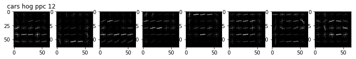

**Vehicle Detection Project**

The goals / steps of this project are the following:

* Perform a Histogram of Oriented Gradients (HOG) feature extraction on a labeled training set of images and train a classifier Linear SVM classifier
* Optionally, you can also apply a color transform and append binned color features, as well as histograms of color, to your HOG feature vector. 
* Note: for those first two steps don't forget to normalize your features and randomize a selection for training and testing.
* Implement a sliding-window technique and use your trained classifier to search for vehicles in images.
* Run your pipeline on a video stream (start with the test_video.mp4 and later implement on full project_video.mp4) and create a heat map of recurring detections frame by frame to reject outliers and follow detected vehicles.
* Estimate a bounding box for vehicles detected.

[//]: # (Image References)
[image1]: ./examples/car_not_car.png
[image2]: ./examples/HOG_example.jpg
[image3]: ./examples/sliding_windows.jpg
[image4]: ./examples/sliding_window.jpg
[image5]: ./examples/bboxes_and_heat.png
[image6]: ./examples/labels_map.png
[image7]: ./examples/output_bboxes.png
[video1]: ./project_video.mp4

## [Rubric](https://review.udacity.com/#!/rubrics/513/view) Points
###Here I will consider the rubric points individually and describe how I addressed each point in my implementation.  

---
###Writeup / README

####1. Provide a Writeup / README that includes all the rubric points and how you addressed each one.  You can submit your writeup as markdown or pdf.  [Here](https://github.com/udacity/CarND-Vehicle-Detection/blob/master/writeup_template.md) is a template writeup for this project you can use as a guide and a starting point.  

You're reading it! All of the code for this project is in `vehicle-detection.ipynb` file.

###Histogram of Oriented Gradients (HOG)

####1. Explain how (and identify where in your code) you extracted HOG features from the training images.

The code for this HOG features extraction is in the Utility function code cell. There are two functions. During feature extraction for training a classifier, `get_hog_features` is called to extra the hog features. During prediction, `find_car_windows` function is called to extract features using hog sub-sampling. Prediction process uses a multi-scale sliding windows technique that breaks up an image into many smaller windows, and we have to extract the hog features for each small windows to make a prediction. The hog sub-sampling technique allows us to to extract the hog features only once for the entire search area in the image, and subsample the features in the prediction process.

####2. Explain how you settled on your final choice of HOG parameters.

I started by reading in all the `vehicle` and `non-vehicle` images.  Here is an example of the `cars` and `not cars` classes:

I then explored different color spaces and different `skimage.hog()` parameters (`orientations`, `pixels_per_cell`, and `cells_per_block`).  I grabbed random images from each of the two classes and displayed them to get a feel for what the `skimage.hog()` output looks like.

Here are examples visualizing HOG parameters of `orientations=9`, `cells_per_block=(2, 2)` and different values `pixels_per_cell` parameters for both cars and not cars images. I performed many more visualizations like this during data exploration.

After visualzing the effects of the HOG parameters, I move on to verify the effects of the HOG parameters on the classifier accuracy and feature size. To do this, I train a test classifier with a subset of the data. I would change the parameters and observe their effects on the feature size and accuracy. This process can be seen in the "Explore and find features for Classifier" code block in the notebook. 

####3. Describe how (and identify where in your code) you trained a classifier using your selected HOG features (and color features if you used them).

The training of the classifier is in the "Train a Classifier" code cell. I used a `LinearSVC` classifier for its combination of speed and performance. I used spatial binning, color histogram and hog features in the classifier. For the training, I first extract the features from the images. Then I used `StandardScaler` to normalize the data. Then I split the data into 20% test and 80% training to combat overfitting. 

The features I chose result in a feature vector length of 8460 and achieved an accuracy of 98.82%.

###Sliding Window Search

####1. Describe how (and identify where in your code) you implemented a sliding window search.  How did you decide what scales to search and how much to overlap windows?

A sliding window search is used. It's implmented in the "Find scale and vertical range to scan for cars" cell block in `find_cars` function.

To come up with the parameters for the sliding windows implementation, I mainly did it with trial and errors. However, there are a few intuitions that help me limit the area I had to do experiment. 

To determine the area of the image we need to perform sliding window search, I know I can limit on the search on the y axis as we don't expect to find any cars in certain places: 1) In the top half of the image as it's mostly skyline and tree tops. 2) Near the bottom of the image as it only captured the hood of the car. 

To determine the scale, I know cars closer to the camera will be bigger versus cars that are further will be smaller. To capture cars that could be of varying distance from the camera, I will pick multiple scales to capture both large and small vehicles.

After visualing the result of applying various sliding windows parameters on test images, I decided on the following parameters:
* y range to search: 400 - 680
* x range to serach: 0 - 1280 (entire horizontal range)
* scales: 1.0 and 2.0
* overlap: 75%. (This is defined in `find_car_windows` function as `cells_per_step` parameter. Because I am using hog-subsampling, instead of cell overlap, This is controlled by how many cells to step. The value I used is 2. Since I am using 8 cell per clock, 2 cells per step gives us a 75% overlap)

####2. Show some examples of test images to demonstrate how your pipeline is working.  What did you do to optimize the performance of your classifier?

Here are some example images. As you can see in the example images, there are a couple false positives. In the section below, I will explain how I remove those false positivies.

---

### Video Implementation

####1. Provide a link to your final video output.  Your pipeline should perform reasonably well on the entire project video (somewhat wobbly or unstable bounding boxes are ok as long as you are identifying the vehicles most of the time with minimal false positives.)

Here's a [link to my video result](https://www.youtube.com/watch?v=X-nqW_4AKtg)

####2. Describe how (and identify where in your code) you implemented some kind of filter for false positives and some method for combining overlapping bounding boxes.

The false positive filtering code is in the "Process Video Image - Use heatmap and apply thresholding to eliminate false positives" code cell.

The processing pipeline performs following to handle false positives and combining overlapping bounding boxes
1. Using sliding windows scheme, find all windows that have vehicles detected in the current frame
2. Save the detected windows to a history list. The history list keeps detected windows in the last 10 frames. Each item in the list is all the detected windows in one frame. 
3. Get all the detected windows in the last 10 frames from the history list.
4. Create a heat map from all the detected windows
5. Apply a threshold (I used 3). Unless the false positive is detected in multiple frames (or unlikely but possible, false positive is detected in multiple windows in one frame), it will get filtered out here by this step.
6. Use `scipy.ndimage.measurements.label()` to identify individual blobs in the heatmap.  I then assumed each blob corresponded to a vehicle.  I constructed bounding boxes to cover the area of each blob detected.  

Here are examples of that pipeline (without thresholding):

---

###Discussion

####1. Briefly discuss any problems / issues you faced in your implementation of this project.  Where will your pipeline likely fail?  What could you do to make it more robust?

The output video shows that this project does a reasonable job of identifying where the vehicles are on the road. However, there are a few problems with the implementation.
1. The pipepline is too slow. It took ~20 minutes to process a ~1 minute video. It took ~20 second to process 1 frame! This is too slow to be useful in a real self driving car. A lot of optimization would be needed. A big part of this slow down comes from extracting the hog features and also from repeatedly making predictions on hundreds of sliced windows. To improve it, I would consider taking a different approach and train a convnet to detect vehicle and bypass hog feature extraction altogether. 
2. The bounding boxes are sometimes too big and sometimes too small. Ideally we need the bounding boxes to be just big enough or slighly bigger than the actual vehicle. If the box is too big, we could perceive a vehicle to be blocking us when its not. On the other hand, if the bounding box is too small, we could perceive the road to be unobstructed when it is!
3. There are false positives. Even with a thresholded heatmap approach across previous 10 frames, there are still a few false positivies. To improve this, I would probably work on a training a better classifier with a larger data set. Convnet is known to perform well for image classification, so that's probably where I would start.

